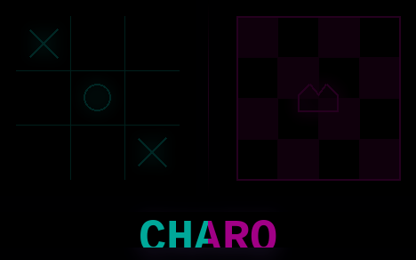

<div align="center">



**Hệ thống game chiến thuật — Caro & Chess trên nền Python + Pygame**


</div>

---

## Giới thiệu

**CHARO** là đồ án cuối kỳ môn Cấu trúc dữ liệu & Giải thuật, xây dựng hệ thống gồm hai trò chơi chiến thuật tích hợp trong cùng một launcher:

- **Caro** — Ba chế độ bàn cờ (3×3, 4×4, 10×10), mỗi chế độ hỗ trợ PvP và PvE với 3 mức độ khó
- **Chess** — Cờ vua tiêu chuẩn FIDE, hỗ trợ PvP và PvE với 3 mức độ khó

Toàn bộ AI được xây dựng từ đầu, không sử dụng thư viện game AI bên ngoài.

---

## Cấu trúc dự án

```
dsa_final_project/
│
├── main_menu.py          # Launcher chính — giao diện chọn game & chế độ
│
├── caro/
│   ├── core_engine.py    # Board, GameEngine, BaseAI
│   ├── ai_3x3.py         # AI cho bàn 3×3 (Minimax)
│   ├── ai_4x4.py         # AI cho bàn 4×4 (Minimax + PST)
│   ├── ai_5x5.py         # AI cho bàn 10×10 (Alpha-Beta + Zobrist + Memo)
│   └── caro_gui.py       # Giao diện Pygame
│
├── chess/
│   ├── bitboard.py       # Biểu diễn bàn cờ bằng 64-bit Bitboard
│   ├── move.py           # Mã hoá nước đi 16-bit (Bit Packing)
│   ├── move_generator.py # Sinh nước đi hợp lệ cho tất cả quân
│   ├── game_state.py     # Trạng thái ván cờ, make/unmake move, Zobrist
│   ├── evaluation.py     # Đánh giá Material + Piece-Square Table
│   ├── ai_engine.py      # Alpha-Beta + TT + Quiescence Search
│   ├── board_editor.py   # Công cụ dựng thế cờ
│   └── gui.py            # Giao diện Pygame
│
└── docs/
    └── charo.gif
```

---

## Sơ đồ điều hướng

```
CHARO
├── CARO
│   ├── 3×3 ── PvP
│   │        └── PvE  (Easy / Medium / Hard)
│   ├── 4×4 ── PvP
│   │        └── PvE  (Easy / Medium / Hard)
│   └── 5×5 ── PvP
│            └── PvE  (Easy / Medium / Hard)
└── CHESS
    ├── PvP
    └── PvE  (Easy / Medium / Hard)
```

---

## Tính năng nổi bật

### Caro

| Tính năng | Chi tiết |
|---|---|
| Ba chế độ bàn cờ | 3×3 (win-3), 4×4 (win-4), 10×10 (win-5) |
| Hai chế độ chơi | PvP, PvE được chọn ngoài menu |
| Gợi ý nước đi | Bấm **S** để xem nước tốt nhất cho lượt hiện tại |
| Undo | Bấm **Z** để rút lại 2 nước gần nhất |
| Restart | Bấm **R** để chơi lại ván mới |
| Exit | Bấm **ESC** để thoát / quay lại menu |


### Chess

| Tính năng | Chi tiết |
|---|---|
| Luật cờ tiêu chuẩn | En passant, nhập thành, phong cấp đầy đủ |
| Hai chế độ chơi | PvP, PvE được chọn ngoài menu |
| Board Editor | Bấm **E** để dựng bàn cờ nhập cuộc tùy ý để chơi |
| Gợi ý nước đi | Bấm **S** để hiển thị nước gợi ý |
| Undo | Bấm **Z** để rút lại nước đi |
| Restart | Bấm **R** để chơi lại ván mới |
| Exit | Bấm **ESC** để thoát / quay lại menu |


## Thuật toán & Cấu trúc dữ liệu

### Chess Engine

- **Bitboard** — mỗi loại quân lưu trong 1 số nguyên 64-bit, thao tác bit tốc độ cao
- **Bit Packing** — mỗi nước đi nén vào 16-bit (6-bit start, 6-bit target, 4-bit flag)
- **Zobrist Hashing** — hash trạng thái ván cờ để phát hiện lặp và cache Transposition Table
- **Alpha-Beta + TT** — Transposition Table với 3 flag (EXACT / LOWER / UPPER)
- **Quiescence Search** — tránh horizon effect bằng cách tiếp tục tìm ở các nước ăn quân
- **MVV-LVA** — sắp xếp nước ăn quân: nạn nhân giá trị cao × 10 − kẻ tấn công

### Caro AI (10×10)

- **Alpha-Beta + Memoization** — kết hợp Zobrist hash để tránh tính lại trạng thái
- **Move Ordering** — chấm điểm nước trước minimax để pruning hiệu quả hơn
- **Bounding Box** — chỉ quét vùng có quân ± 4 ô, bỏ qua hoàn toàn vùng trống
- **Forced Move Detection** — ưu tiên ngay nước thắng / nước chặn thua ở tầng ngoài

---

---

## Yêu cầu hệ thống

```
Python >= 3.10
pygame >= 2.0
```

Cài đặt thư viện:

```bash
pip install pygame
```

Để chạy test suite của chess (tuỳ chọn):

```bash
pip install python-chess
```

---

## Cách chạy

```bash
# Clone về máy
git clone https://github.com/tqhung9a1-pixel/dsa_final_project.git
cd dsa_final_project

# Chạy launcher chính
python main_menu.py
```

---

## Tác giả

**Trần Quốc Hưng**
**MSSV: 25520660**

> *Đồ án được thực hiện trong khuôn khổ môn Cấu trúc dữ liệu & Giải thuật*